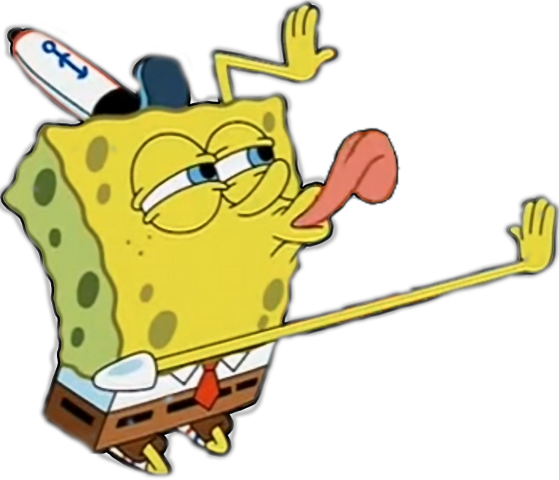

# Ze Buttler 

This is a desktop application that manages your todos and provides AI-powered notifications to keep you on track. Ze Buttler is here to remind you of your tasks with existential dread.

## Features

- Create and list todos with deadlines
- System tray integration
- AI-powered notifications at random intervals
- Automatic deletion of past-due tasks

## Requirements

- Go 1.16+
- SQLite3
- Fyne GUI toolkit
- Groq API key
- KDE environment (for default notifications, for other systems read below)

## Installation

1. Clone this repository
2. Install dependencies:
   ```
   go get fyne.io/fyne/v2
   go get github.com/mattn/go-sqlite3
   ```
3. Set up your Groq API key as an environment variable:
   ```
   export GROQ_API_KEY=your_api_key_here
   ```
4. Build and run the application:
   ```
   go build -o ze-buttler .
   ./ze-buttler
   ```

## Usage

- Click on the system tray icon to access the menu
- Use "Create Todo" to add new tasks
- Use "List Todos" to view your current tasks
- "Ze Buttler" will periodically remind you of your tasks

## Customization

### AI Provider

This application uses Groq for AI capabilities. To use a different provider:

1. Modify the `CallAI` function in `api.go`
2. Update the API endpoint and request format
3. Adjust the environment variable name for the API key

### Notifications

The current implementation uses `kdialog` for notifications, which is specific to KDE environments. Here are alternatives for other systems:

#### macOS

Update the `Alert` function in `beep.go`:

```go
func Alert(title, message, appIcon string) error {
    script := fmt.Sprintf(`display notification "%s" with title "%s"`, message, title)
    cmd := exec.Command("osascript", "-e", script)
    return cmd.Run()
}
```

#### Windows

For Windows, you can use PowerShell's `New-BurntToastNotification`:

```go
func Alert(title, message, appIcon string) error {
    script := fmt.Sprintf(`
        [Windows.UI.Notifications.ToastNotificationManager, Windows.UI.Notifications, ContentType = WindowsRuntime] | Out-Null
        [Windows.UI.Notifications.ToastNotification, Windows.UI.Notifications, ContentType = WindowsRuntime] | Out-Null
        [Windows.Data.Xml.Dom.XmlDocument, Windows.Data.Xml.Dom.XmlDocument, ContentType = WindowsRuntime] | Out-Null

        $template = @"
        <toast>
            <visual>
                <binding template="ToastGeneric">
                    <text>%s</text>
                    <text>%s</text>
                </binding>
            </visual>
        </toast>
"@

        $xml = New-Object Windows.Data.Xml.Dom.XmlDocument
        $xml.LoadXml($template)
        $toast = New-Object Windows.UI.Notifications.ToastNotification $xml
        [Windows.UI.Notifications.ToastNotificationManager]::CreateToastNotifier("Ze Buttler").Show($toast)
    `, title, message)

    cmd := exec.Command("powershell", "-Command", script)
    return cmd.Run()
}
```

#### Other Linux Distributions

For other Linux distributions, you can use `notify-send`:

```go
func Alert(title, message, appIcon string) error {
    cmd := exec.Command("notify-send", "-i", appIcon, title, message)
    return cmd.Run()
}
```

## AI Personality

You can provide a personality by modifying the system prompt in `api.go`.

## Contributing

Contributions are welcome! Please feel free to submit a Pull Request.
